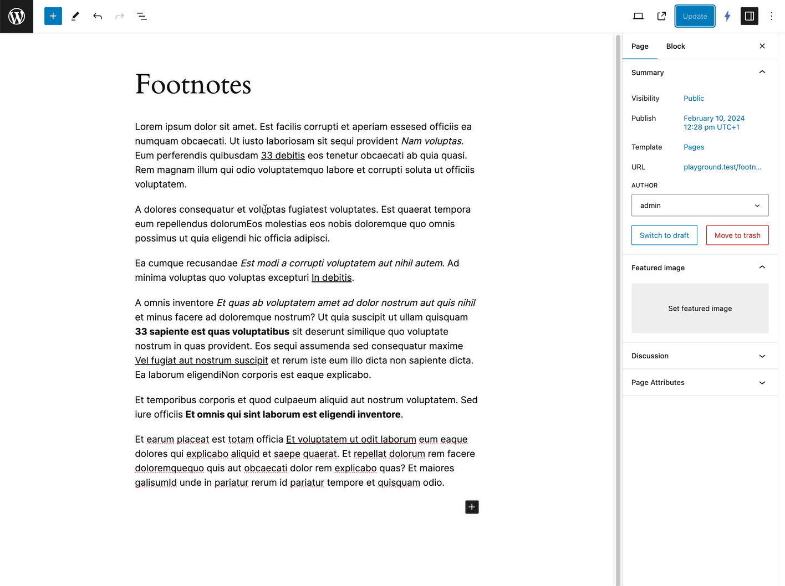

# Littlefoot for Footnotes

> Elegant, interactive popups for the Footnotes block.

## Description

Elevate your website's user experience by incorporating lightweight and visually appealing footnotes using [littlefoot](https://github.com/goblindegook/littlefoot).
This WordPress plugin extends the functionality of the Footnotes block, seamlessly integrating the littlefoot JavaScript library to transform static footnotes into interactive popups.



## Requirements

* PHP 7.4+
* WordPress 6.4

## Installation

### Manual Installation:

1. Download the plugin ZIP file from the GitHub repository.
2. Go to Plugins > Add New > Upload Plugin in your WordPress admin area.
3. Upload the ZIP file and click Install Now.
4. Activate the plugin.

### Install with Composer:

To include this plugin as a dependency in your Composer-managed WordPress project:

1. Add the plugin to your project using the following command:

```bash
composer require s3rgiosan/littlefoot
```

2. Run `composer install` to install the plugin.
3. Activate the plugin from your WordPress admin area or using WP-CLI.

## Options

### `activateDelay`

Sets a delay between the activation of the footnote button and the activation of the actual footnote content.

Default: `100`

### `allowDuplicates`

Determines whether or not a footnote can be used as the content for multiple footnote buttons.

Default: `false`

### `allowMultiple`

Specifies whether or not multiple footnote popovers can be active simultaneously.

Default: `false`

### `dismissDelay`

When the footnote content is being removed this option specifies how long after the active class is removed from the footnote before the element is actually removed from the DOM.

Default: `500`

### `dismissOnUnhover`

Determines whether footnotes that were presented when hovering on a footnote button are dismissed once the footnote button or footnote popover is un-hovered.

Default: `false`

### `hoverDelay`

Specifies the amount of time (in milliseconds) that must pass after the footnote button/content is un-hovered before the footnote is dismissed.

Default: `250`

## Styling

See [littlefoot.js theming](https://github.com/goblindegook/littlefoot/blob/main/README.md#theming) section.

## Changelog

A complete listing of all notable changes to this project are documented in [CHANGELOG.md](https://github.com/s3rgiosan/littlefoot/blob/main/CHANGELOG.md).

## License and Attribution

This plugin is licensed under MIT.

This project incorporates [littlefoot.js](https://littlefoot.js.org/), which is licensed under the [MIT License](https://github.com/goblindegook/littlefoot/blob/main/LICENSE).
